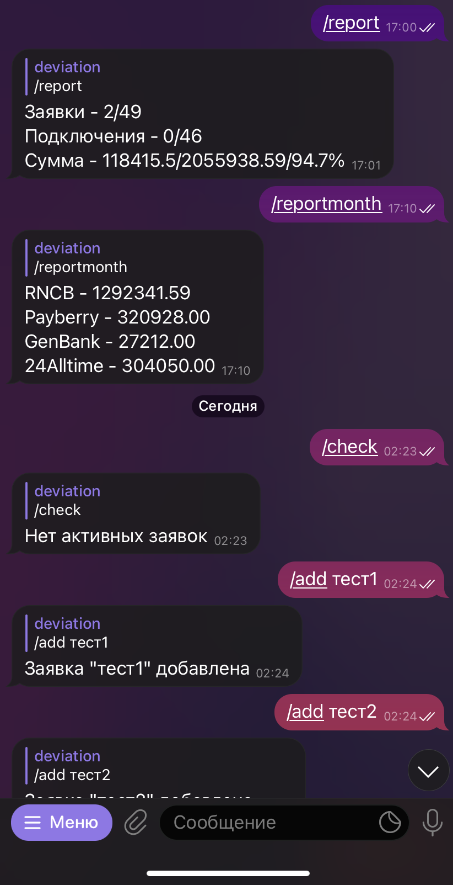
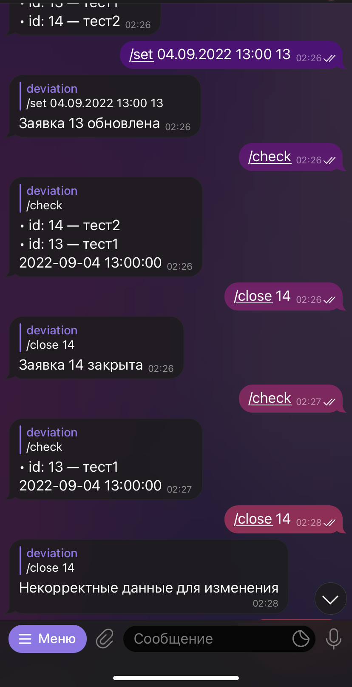

# ISP Telegram Bot

The bot was written to automate part of the work of technical support workers. 
It allows you to keep records of daily or monthly cash transfers.
The bot also allows you to control requests for repair work (create, set
the time of execution, close and view active ones).

## Usage examples
<table>
    <tr>
        <td></td>
        <td></td>
    </tr>
</table>

